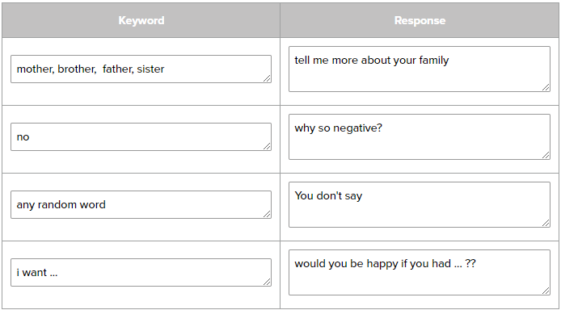

# Lesson 1.1.2

 5 7 17

 #5. MediaLib and SecondClass are similar in which they begin with the main method, as well as a single System.out.println

 #7. Four variable types are int, String, boolean, and double

 #17. The line that is shown is Songs@75412c2f

 Conclusion #1: - the advantages of getters and setters is that they are g0ood at storing data, but they are confusing at times

 Conclusion #2: - All of these classes share the same title and rating fields. This could be reduced by squeezing all of the classes into one to remove duplication

# Lesson 1.1.3

 8 12

 #8. If you wanted one that could change to ant boolean value, you would want to put a "boolean f" inside the parentheses and put "favorite = f" instead of declaring the value to be true. I personally prefer the one where you can declare whatever value you want

 #12a. The naming convention is called camel casing 

 #12b. totalCost should be a double because each of your prices isn't going to come out to an exact integer, so if you use int it will round up 

 Conclusion #1: You might want to have more than one constructor if you want to give out a certain amount of variables at different points

#Lesson 1.1.4

 1 10 25 27 28

#1a. You can tell a string is an object and not a primitive type because it has a capital 'S'

#1b. "null" means that the variable doesn't have any value assigned to it

#1c. If you wanted to print out "This is a test message" you could start with either using System.out.println or System.out.print. Alternatively, you could simply initialize a variable String to say "This is a test"

#1d. A superclass is the beginning class that all other subclasses of its type are derived from

#1e. The superclass of String would simply be the Object class

#1f. You can use an "instanceof" operator to check where an object belongs

#10. The difference between == and equals. is that one can compare addresses and the other compares content

#25. The operator of || will always short circuit, granted that the first value is true

#27a.  (!(sunny && clear))

#27b.  (raining || snowing)

#28a. if(temperature <= 75)

#28b. if(temperature > 100)

#28c. if(temperature != 32)

#Lesson 1.1.5

 1 2

#1. You would want to call a static method by doing Math.sqrt(25)

#2. One essentially rolls a 12 sided die to simulate rolling two standard die. The other simulates rolling two separate die to get their own values.
 The first one doesn't make as much sense for if you wanted to see doubles, so the second would be more realistic

 Conclusion #1. The algorithm uses the length -1 because otherwise it would basically see it as 1 longer than it should be and create a bound error

 Conclusion #2. The difference between the two statements is that the first one will always output to being 1 and the second will actually return a number between 1 and 10 

#Lesson 1.1.6

 1 2 3 4 13

#1a. When you enter the various results, they reply with the same simple responses, replying about family or weather.

#1b. You can tell that there are certain keywords that will trigger a response,
where you could most likely make no sense with what you say and still get the same response, as long as you use the keyword

#1c. Some of the keywords present are "no" "mother" "where" and "weather" bring about responses asking about the weather or telling you to talk more about your family

#2b. My mother and I talked last night : tell me more about your family
        I said no! : Why so negative?
        The weather is nice : you don't say
        Do you know my brother : why so negative

#2d.  

